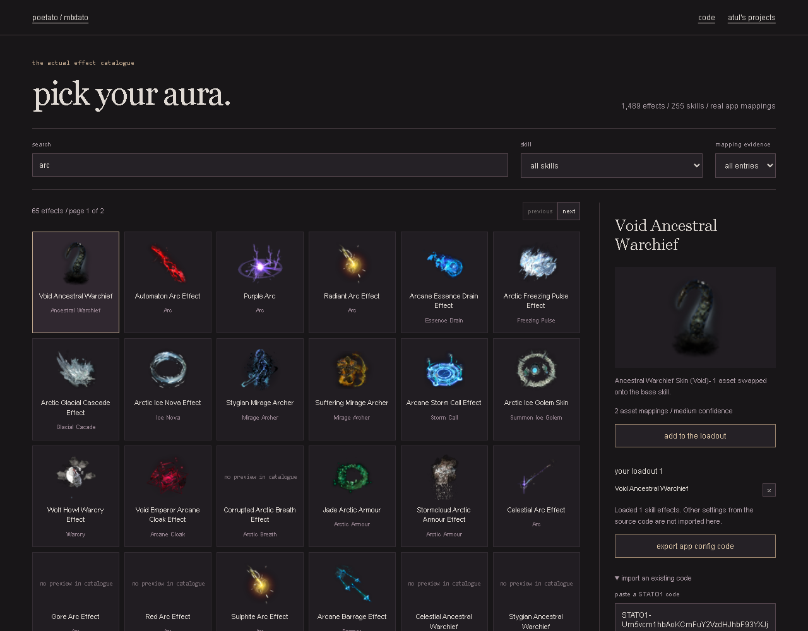

# MTXtato effect wardrobe

**[Open the full catalogue](https://lolstar123.github.io/mtxtato-catalogue/)**

Search 1,489 actual skill-effect records, inspect 1,107 bundled preview icons, choose one
effect per skill and export a real **STATO1** configuration code for the application.
Import an existing code to load the skill effects it contains.



Selections are checked for conflicting base-asset mappings before export. Entries without
an asset mapping cannot be added. A missing preview is shown as missing; no replacement
artwork is invented. Your loadout is saved in your browser.

## Run

```sh
python -m http.server 8000 --directory examples/portfolio
node --test examples/portfolio/model.test.mjs
```

The share-code encoder follows the actual application's `ConfigCode.cs`: preset-relative
newline fields, R/raw payload, base64url and its six-bit checksum. The decoder accepts both
R/raw and D/deflate-raw payloads. Export creates a skill-only loadout, with other options left
at normal/default. Import does not preserve unrelated options from the original code.

| Path | Purpose |
| --- | --- |
| `examples/portfolio/data/catalogue.json` | Actual app skill records and asset mappings |
| `examples/portfolio/icons` | Actual app preview artwork |
| `examples/portfolio/model.mjs` | Share-code codec, conflict checks and skill selection |
| `tools/browser_audit.py` | Search, real image, selection and code export/import checks |

The browser prepares a configuration. Applying it to a game installation happens in the
[desktop app](https://poetato.app). Automated public browser checks run every four hours.
Preview art retains its original ownership and is not covered by the code license.
