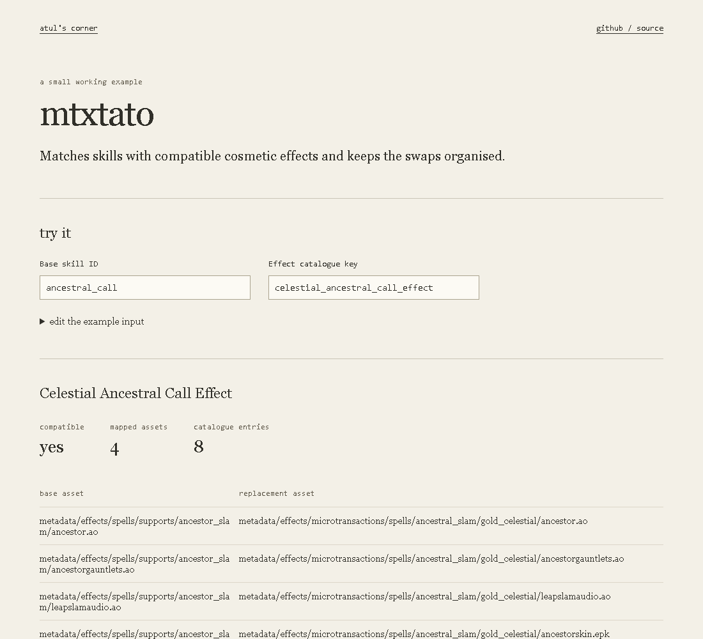

# mtxtato catalogue

**Current project: [smoothtato](https://github.com/LolStar123/smoothtato-preview) ? [Open cosmetics](https://lolstar123.github.io/smoothtato-preview/cosmetics/).** The graphics remover and cosmetics catalogue now share that repository. The old Pages home redirects there.

This checkout preserves the standalone catalogue: browse Path of Exile skill effects, inspect their base-to-cosmetic asset mappings, select one effect per skill, and export a `STATO1` loadout code. It uses 1,489 records from the desktop application's catalogue, with 1,107 local preview files. The browser does not modify game files.



## Run the preserved version

Use Python 3 to serve files and Node.js 22+ for model checks. No package install or account is needed.

```sh
git clone https://github.com/LolStar123/mtxtato-catalogue.git
cd mtxtato-catalogue
node --test examples/portfolio/model.test.mjs
python -m http.server 8000 --bind 127.0.0.1 --directory examples/portfolio
```

Open **http://127.0.0.1:8000/legacy.html**. Opening `/` follows the current-tool redirect. Historical HTML and its stylesheet are preserved separately so the local catalogue remains runnable.

Search by effect or skill, filter mapping confidence, then select a card to read its asset pairs. **Add to loadout** replaces the current selection for that skill. Conflicting base-asset replacements block export. **Export** downloads `mtxtato-loadout.txt`; paste its `STATO1-...` code into the desktop application's config-code field. The import box checks the checksum and rejects effects outside this catalogue.

Selections persist in this browser's local storage. Config export includes skill-effect choices; licence keys, machine settings and unrelated settings are excluded. A missing image says there is no preview in the catalogue.

## Repository map

| Path | Responsibility |
|---|---|
| [examples/portfolio/index.html](examples/portfolio/index.html) | Redirect and current-app fallback link |
| [examples/portfolio/legacy.html](examples/portfolio/legacy.html) | Runnable historical catalogue interface |
| [examples/portfolio/legacy.css](examples/portfolio/legacy.css) | Preserved historical layout |
| [examples/portfolio/app.mjs](examples/portfolio/app.mjs) | Search, filtering, preview, loadout and file export |
| [examples/portfolio/model.mjs](examples/portfolio/model.mjs) | Mapping conflicts, one-effect-per-skill selection and encoding/decoding |
| [examples/portfolio/model.test.mjs](examples/portfolio/model.test.mjs) | Round trips, damaged codes and conflicting mappings |
| [examples/portfolio/data/catalogue.json](examples/portfolio/data/catalogue.json) | Desktop catalogue snapshot |
| [examples/portfolio/icons](examples/portfolio/icons) | Local previews |
| [PROVENANCE.md](PROVENANCE.md) | Source paths, format origin and artwork ownership |
| [DESIGN.md](DESIGN.md) | Interface boundaries and archival behavior |

## Checks and limits

Run the model tests, then verify a filtered result, selection, exported code and import before relying on a changed catalogue.

Mapping confidence comes from the original app data; it is not a compatibility guarantee for today's game build. Preview artwork belongs to its owners, including Grinding Gear Games. Raw and deflated config codes are supported; deflated import needs a browser with `DecompressionStream('deflate-raw')`. Current development belongs in smoothtato.

For the optional browser audit, install `playwright` with `python -m pip install playwright`. On Linux, also run `python -m playwright install --with-deps chromium`; on Windows the audit uses installed Chrome. `python tools/browser_audit.py` serves the actual archived files and checks the public-index redirect against a controlled destination, without claiming the current remote application was tested. Set `AUDIT_URL` to verify a deployed legacy redirect instead of the local index.
